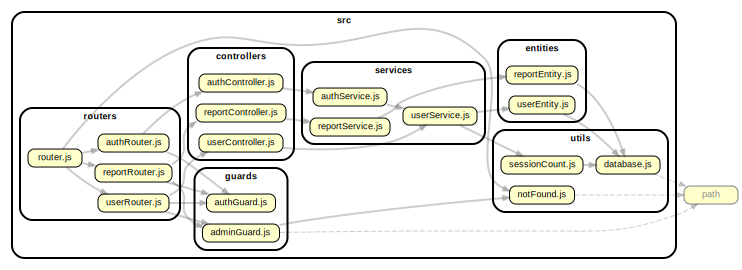

# API
download npm packages:
`npm install`

copy the '.env.sample' file to '.env' before running any script
`cp .env.sample .env`

run development:
`npm run start:dev`

run test:
`npm run start:test`

## <u>Endpoints</u> :
- /users
    - / (GET) : get all users
        - admin required
    - /connected (GET) : get number of user connected
    - /me (GET) : get user personal info
        - authentication required
- /auth
  - /signup (POST)
    - fields required: firsname, lastname, email and/or phone, password
    - addictional fields: birthdate, pref ('phone'|'email')
  - /signin (POST)
    - fields required: email or phone, password
  - /signout (POST)
    - authentication required
  - /test (GET) : test page to test guard
    - authentication required
- /reports
  - / (GET) : get all reports
    - admin required
  - /me (GET) : get user reports
    - authentication required
  - /send (POST)
    - required fields : type ('nature'| 'obstacle'| 'infrastructure'| 'dumping'| 'association')
    - authentication required

## <u>Entities</u> :
- **User** (+ session: isLogged (bool), userId(number))
  - id (number generated by sequelize)
  - lastname (string) (not null)
  - firstname (string) (not null)
  - email (string) (unique, can be null if phone)
  - phone (string) (unique, can be null if email)
  - password (string) (crypted) (not null)
  - birthdate (Date)
- **Report**
  - id (number generated by sequelize)
  - type (string: 'nature'| 'obstacle'| 'infrastructure'| 'dumping'| 'association') (not null)
  - lon (number decimal 11/2) (allow null: will change after getting location from user)
  - lat (number decimal 11/2) (allow null: will change after getting location from user)
  - userId (number given by session.userId) (not null)

## Dependency graph
run this command to generate the .svg file `npm run dependency`
(required `depcruise` and `dot` commands)

## <u>workflow</u> :
1. entity
2. (repository)
3. service
4. controller
5. router
6. app

***
Feature ideas:
...

***
Project info:
- 1 high vulnerability (faker)

